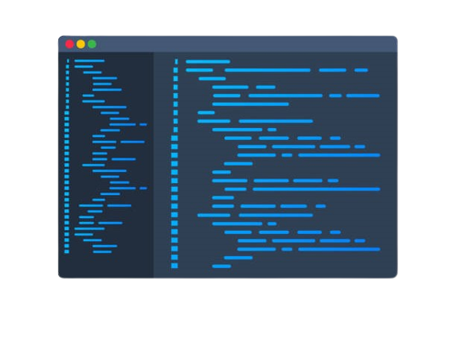

  

  
<!--  -->
  

<!-- src="https://cdn.dribbble.com/users/1162077/screenshots/3848914/programmer.gif" -->

- I'm currently learning Mathematics for Machine Learning Specialization from coursera  
  

-  Ask me about anything related to Artificail intelligence field or related technologies  
  

-  Fun fact: if you can't resist rape, enjoy it  

  

  

>   For more information you can access   **[CV](https://github.com/AhmedAchraf2001/CV/blob/main/Ahmed%20Ashraf-CV.pdf)**
  
</td><td valign="top" width="33%">

</td><td valign="top" width="33%">

</td></tr></table>  

 
   

## Github Statistics  

  
 

<!--  -->

## Connect me  

 
  

  
  
 
 
  
 
  

  

  
  
<!--  -->
  
<!--  -->
  

  

  
  

   

<!--    

 -->
  
  
 

<!-- font-size="36px" -->

  

</td><td valign="top" width="33%">

